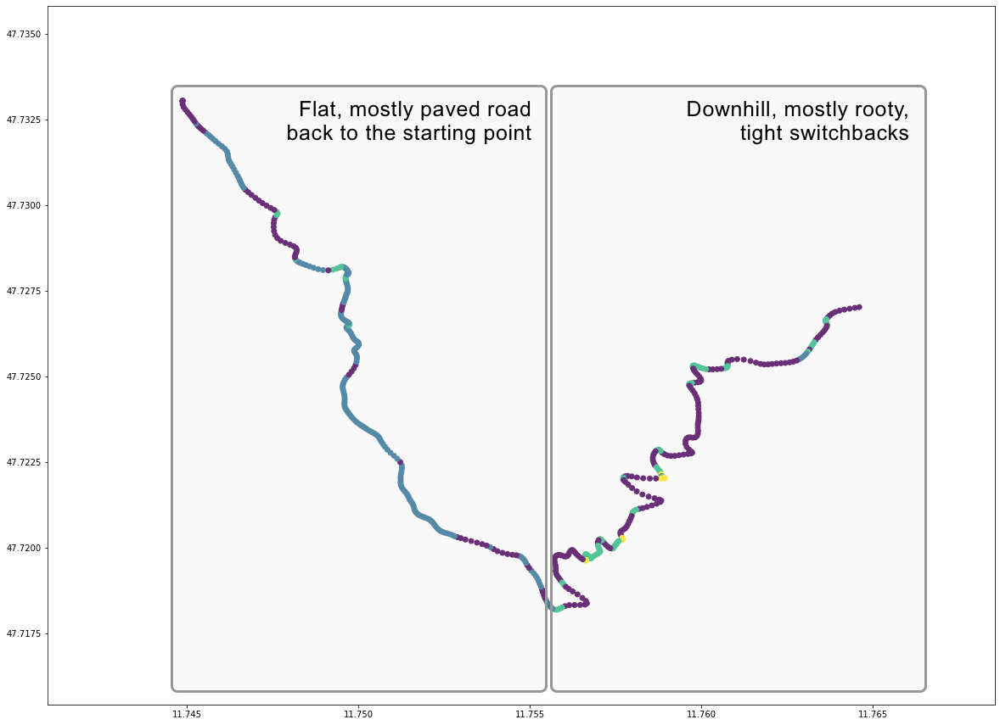

# TANIA, the TrAil iNdIcAtor - Testing Human to Machine Learning communication in the sport of Mountainbiking

### Abstract 
There are many different gradings of Mountainbike trail difficulties around the world, with each being biased by subjectivenes.
In this work, we instead let an unsupervised machine learning algorithm cluster segments of trail into what represent typical patterns.
Instead of interpreting the clusters as difficulties or styles, we let the machine learning algorithm communicate with the mountain biker directly during a ride.
For this purpose, we developed TANIA, the TrAil iNdIcAtor.
This device sits on the mountainbiker's handlebar, indicating upcoming trail pattern (cluster) changes through coloured LEDs.
In a user study, we let five mountainbike riders interpret the indications during a ride and find, that the resulting clusters represent styles of trail that are compatible to the athlete's perception.
Moreover, all riders stated, that the system helped prepare for trickier styles of trail, like e.g. steep sections or tight corners, before actually seing them.

1. Introduction
* Related Work
* The dataset
* Machine Learning enhanced clustering 
* TANIA - Enabling Human to Machine Learning communication
* Evaluation
* Future Work

KMeans Clustering, 10s samples with 4s subsamples